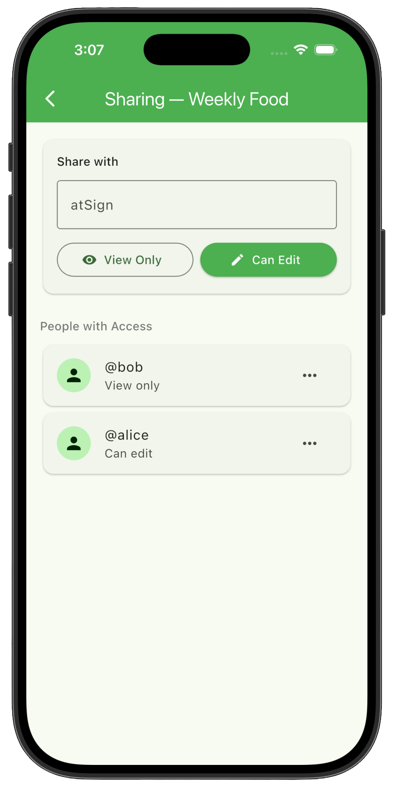

# How to Think When Creating a Blueprint

### Introduction

When you open this starter blueprint in AI Architect, you’re looking at something intentionally simple: Two people share a grocery list. One adds items, and the other sees them.

While this works as a basic concept, a blueprint needs more depth to generate high-quality functional code. This tutorial teaches you how to look at a simple blueprint and extend it in a way that improves the **data flows**, **actor responsibilities**, and **system behaviors**. These are the three things AI Architect relies on most when generating applications.

#### Perspective shift

Before you begin, it is helpful to shift your focus from adding _features_ to identifying the **behaviors** required by your app's data flows.

### What you’ll learn

* What to consider when thinking about actors, data, and flows
* How to extend a blueprint in a way that AI Architect can make use of
* How to identify missing behaviors, not just missing features

### Starter blueprint

To get started, go to [**aiarchitect.atsign.com**](https://www.aiarchitect.atsign.com/). From the home screen, select **Start with an Example Blueprint**, then choose the **Grocery List App** blueprint to load the example.

Page 1, is the starting point. Before you change anything, let's take a moment to understand the actors, data, and flows.



<figure><picture><source srcset="../../.gitbook/assets/Screenshot 2026-04-27 at 4.25.34 PM.png" media="(prefers-color-scheme: dark)"></picture><figcaption></figcaption></figure>



### 1. Start with the people (actors)

At the core of this app are two actors: the **creator** (who adds items) and the **viewer** (who sees them).


**Goal**\
\
Understand the roles before adding complexity.



**Consider**

* Who creates data?
* Who consumes it?
* Does each actor have a clear purpose?



**Why it matters**\
\
AI Architect is actor-driven. If an actor doesn’t meaningfully create, transform, or act on data, the generated application will feel passive or incomplete.


### 2. Understand the data

The core data objects are the **grocery list** and the **list item**. These are the “source of truth” for the entire app.


**Goal**\
\
Map the data that exists independently of the UI.



**Consider**

* What data would exist even without a screen?
* What data connects actors to each other?



**Why it matters**\
\
AI Architect depends on clear, well‑defined data objects. If the core data objects aren’t clearly defined, the generated application may not behave the way you expect.


### 3. Follow the flow

Right now the flow is linear:

Creator → List item → Grocery list → Viewer


**Goal**\
\
Establish your baseline.



**Consider**

* What happens first, next, and last?
* Where does the app stop being helpful to the actors?



**Why it matters**\
\
Seeing the sequence helps you spot where the chain of communication breaks. When you understand how information moves, it's easier to identify missing behaviors and data flows.&#x20;


### 4. Make the app more responsive

At this stage, the viewer has to check the app manually to see updates. That’s friction we want to remove.


**Goal**

* Turn a static display into a proactive system.



**Action**

* Add a **notification node**
* Create a flow: Grocery List → Notification → Viewer



**Consider**

* Where is the person doing unnecessary work?
* What should the app proactively communicate?



**Why it matters**\
\
AI Architect needs to know when the app should act on its own. Specifying that certain changes should trigger actions allows you to generate a responsive app instead of something static.


### 5. Turn observers into participants

The viewer can see the list but can’t interact with it. Let's give them a more active role.


**Goal**

* Enable interaction for every actor on the canvas.



**Action**

* Add **item status** to the notes section of the **list item** node.
* Update the viewer and creator notes to include the ability to update the status of an item in the list or mark it as completed.



**Consider**

* What data should this actor be allowed to update?
* Who, if anyone, should grant them permission to update data?



**Why it matters**\
\
AI Architect needs to know how each actor meaningfully interacts with the data. When someone only observes information, the app has no behavior to generate around them. Turning an observer into a participant, like letting the Viewer update item status, is a concrete example of using the existing data to extend functionality. By giving the actor a real action on the data, you unlock new flows, richer behavior, and a more complete application.


### 6. Introduce intelligence

Once the core flows are solid, you can add intelligence to transform data into something more useful.


**Goal**

* Provide a structured home for AI logic.



**Action**&#x20;

* Add a **suggestion agent** and **suggested items**
  * Flow: Grocery List App → Suggested items → Suggestion Agent&#x20;
  * You can also add Suggested Items → Notification for reminders and alerts if you'd like



**Consider**

* Is there a pattern in the data?
* Would a human naturally make suggestions here?
* What other parts of the app need to feed into this data flow for it to be complete?



**Why it matters**\
\
Adding an agent isn’t just about making the app “smarter"; it’s about giving the system a clear place to transform data into something more useful. When you introduce intelligence, like a Personal AI agent and suggested items,  you’re showing how the app can use existing data to extend functionality in a purposeful, predictable way. Without this structure, the LLM has nothing reliable to build intelligent behavior around.


### 7. Add descriptions

Think of the description section as the node's job description. This is the most critical step for code generation.&#x20;


**Goal**&#x20;

Provide the manual for the LLM to follow.&#x20;



**Action**

For each node:

* Write its purpose, what data it can access, and how it interacts with other nodes
  * Use natural language or bullet points, as if you were explaining to a developer exactly what you expect this node to do.



**Consider**

* What data does this node own?
* Who can read or write it?
* What else is it used for in the app?



**Why it matters**\
\
AI Architect depends heavily on the description. Descriptions tell us what the node knows, what data it owns, and how it behaves. Without clear descriptions, the blueprint may look complete, but the generated app won’t know what to do. This can lead to missing logic or incorrect flows. Adding descriptions is how you turn a diagram into a blueprint that an LLM can actually build from.


### 8. Define connection types

Now, define how the nodes interact to complete the loop.


**Goal**

Tell the system the speed and method of communication. To learn more about the various connection types, see the [Nodes & Connections](../atsign-ai-architect-overview/nodes-and-connections.md) page.&#x20;



**Action**

Connect each of the nodes so that data can flow through the system in a complete loop. Every component should participate in the app’s behavior, and no node should be left without at least one incoming or outgoing connection.

\
Add/Modify the following connections as:

* Grocery List App > Notification (Notifications)
* Notification > Viewer (Notifications)
* Notification > Creator (Notifications)
* Notification > Suggestion Agent (Notifications)



**Consider**\
\
Is this interaction immediate, background, or interruptive? If you are unsure, you can set it to **data stream**.



**Why it matters**\
\
AI Architect relies on connection types to understand _how_ data should move through the system. These labels tell the platform whether something happens immediately, in the background, or as a notification. If you’re unsure which one to choose, it’s completely fine to use the **default** connection type. The default connection type simply says, “this data may update over time,” and lets the LLM decide how to handle it, which is a safe, flexible choice. You can refine the connection later, but starting with a default connection ensures the system behaves reliably even when the exact timing isn’t clear yet.


### Final Blueprint

That's it! The completed blueprint should represent a full loop of interaction where every component participates in the app's behavior. If you go to page 2 of the Grocery List App blueprint, you will see the final blueprint.



<figure><picture><source srcset="../../.gitbook/assets/Screenshot 2026-04-27 at 4.25.49 PM.png" media="(prefers-color-scheme: dark)"></picture><figcaption></figcaption></figure>



<figure><picture><source srcset="../../.gitbook/assets/Screenshot 2026-04-27 at 4.25.34 PM.png" media="(prefers-color-scheme: dark)"></picture><figcaption></figcaption></figure>



### App Prototype

Now that your blueprint is complete, you’re ready to generate your app prototype using an LLM. To do that, follow the instructions on the [Getting Started with AI Architect](https://docs.atsign.com/tutorials/ai-architect-walkthrough#id-2.-export-the-prompt) page, starting from **Step 2**.&#x20;



&#x20;



### Common Mistakes

<strong>Adding actors who don’t actually do anything</strong>

If an actor has no meaningful actions on the data, the system becomes passive and AI Architect has nothing to generate around them.

<strong>Skipping the data layer</strong>

People jump straight to features or agents without defining the core data objects. Without clear data, the entire blueprint becomes unstable.

<strong>Treating all data as one blob</strong>

Not separating structures, like a Grocery List vs. List Item, leads to vague flows and confusing behavior.

<strong>Ignoring the flow of information</strong>

If you don’t map out who sends what to whom, the system feels unpredictable. AI Architect needs explicit flows to generate correct behavior.

<strong>Forgetting to make the system responsive</strong>

If nothing triggers actions, notifications, updates, or background work, the app may feel static and unhelpful and these will have to be added in later.

<strong>Leaving observers as observers</strong>

When someone only views data, the system stays limited. In some instances this is okay but using the data to extend functionality (like letting the Viewer update item status) unlocks richer behavior

<strong>Writing vague or empty notes</strong>

Nodes without notes force AI Architect to guess. Notes define purpose, ownership, and behavior.

<strong>Not labeling connection types</strong>

If you don’t specify sync, async, or notification, the system can’t generate the right timing or behavior. (And yes, if you’re unsure, defaulting to a data stream is perfectly fine.)

<strong>Over‑engineering the blueprint</strong>

Too many nodes, too many agents, too many flows. Complexity without purpose makes the system harder to understand and harder for AI Architect to generate.

