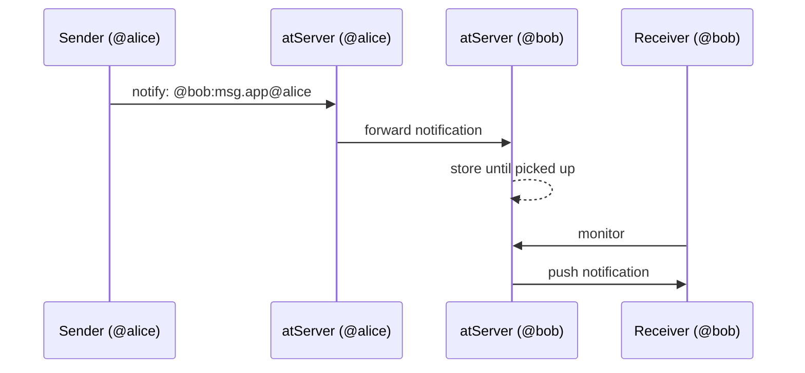

# Events

## How notifications differ from AtRecords

AtRecords are persistent data stored in the atServer's key-value store. An atRecord lives until it is explicitly deleted or its TTL expires, and it syncs across every device that has access.

Notifications are transient. They exist only long enough to be delivered to the subscriber. Once the subscriber's client picks up the notification (or it expires), it is gone.

## Notify and monitor

The notification system in the platform is built on two protocol verbs: `notify` and `monitor`. These two verbs are then implemented on both client and server by our code. Find more information about these verbs in the [atsign-protocol.md](../atsign-protocol.md "mention") documentation.

A **sender** uses the `notify` verb to send a notification to a specific recipient Atsign. Each notification targets exactly one Atsign.

A **receiver** uses the `monitor` verb to listen for incoming notifications. The receiver opens a long-lived connection to its own atServer and receives notifications as they arrive. The receiver can filter by regex so it only receives notifications matching specific namespaces or key patterns.

The sender can notify even when the receiver is offline. The receiver's atServer holds the notification until the receiver connects and picks it up (or until the notification expires). If the receiver's Atsign has multiple clients running on different devices, each client can open its own monitor connection independently. Each monitoring client receives the notifications that match its filters.

## Sending a notification (notify)

When an app wants to notify another Atsign, it uses the `notify` verb and provides four things:

1. **Recipient:** the Atsign that should receive the notification
2. **Namespace:** the namespace the notification belongs to (for example, `buzz` or `my_app`).
3. **Body:** the payload, typically a JSON-encoded string (optional)
4. **Expiration:** how long the notification should live if the receiver has not picked it up yet. Defaults to 15 minutes.

Client SDKs will encrypt the body with the shared encryption key between the sender and recipient, then sends the `notify` command to the sender's atServer. The sender's atServer forwards the notification to the recipient's atServer, which holds it until the receiver's monitor connection(s) picks it up (or it expires).

## Listening for notifications (monitor)

To receive notifications, a client opens a persistent connection to its own atServer using the `monitor` verb. This is a long-lived, authenticated connection that the atServer uses to push incoming notifications to the receiver in real time.

When the monitor connection is established, the atServer streams every notification that has arrived since the receiver last connected (based on a timestamp the client supplies). From that point on, new notifications are pushed to the receiver as soon as they arrive.

The receiver can filter which notifications it receives by supplying a regex pattern when it starts the monitor. Only notifications whose keys match the regex are delivered. This lets an app ignore notifications from namespaces it does not care about without any server-side configuration.

### Stats notifications

The atServer also sends a special system-level notification called a **stats notification** on the monitor connection. The atServer itself generates it whenever the server-side commit log advances (meaning something changed on the server). The client uses this signal to know that it should sync, pulling down whatever new AtRecords were created, updated, or deleted on the server since the last sync.

Stats notifications are how the Atsign Platform keeps every device in sync without polling. The client does not need to check for changes on a timer. It simply monitors the connection, and the atServer notifies it when something changed. Read more on [atrecords.md](atrecords.md "mention").

## Notifications and RPCs

The Atsign Platform builds a higher-level abstraction on top of notifications called **RPCs** (remote procedure calls). An RPC is a request-response pattern where one Atsign sends a request notification to another Atsign, and the receiving Atsign sends back a response notification.

RPCs is not a protocol-level feature, but is actually a client SDK feature. As of August 25, 2026, it is only currently implemented in the [Dart SDK](https://app.gitbook.com/s/pQPWQHMckXtXYemavYhN/dart-sdk "mention").&#x20;

RPCs use the `__rpcs` reserved namespace to avoid collisions with application-level notifications. They provide structured request/response types, automatic correlation of responses to requests, and delivery acknowledgements. Applications like [NoPorts](https://app.gitbook.com/o/Bf7bj1PZlU306XQWDaeE/s/xDhnoLkxryJhtCjj7mE2/) use RPCs to coordinate tunnel setup between devices. Read more about reserved namespaces in [namespaces.md](namespaces.md "mention").

## Reserved namespaces

Certain namespaces like `__rpcs` are reserved for special Atsign Platform operations. Double check the list of reserved namespaces in our [namespaces.md](namespaces.md "mention") page.
