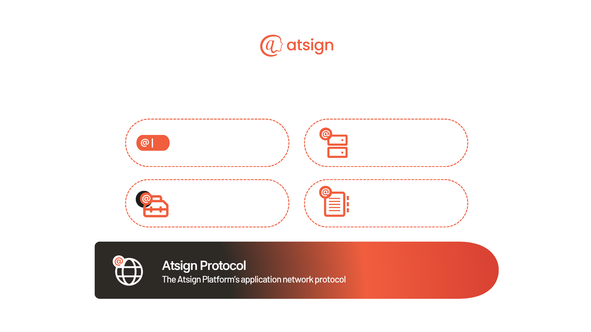

# Atsign Platform Overview

## Overview

Atsign Platform allows people, entities and things to communicate privately and securely without having to know about the intricacies of the underlying IP network. The Atsign Protocol is the application protocol used to communicate, and Atsigns are the addresses on the protocol. All cryptographic keys are cut at the edge by the Atsign owner, meaning only the receiving and sending Atsigns see data in the clear.

Atsign Platform can be used to send data synchronously or asynchronously, and can be used as a data plane, or a control plane, or both, simultaneously at Internet scale.

<figure><figcaption>
Atsign Platform composition (dark mode)
</figcaption></figure>

<figure><figcaption>
Atsign Platform composition (light mode)
</figcaption></figure>

Relationships

Every **atServer** is associated with _one_ **Atsign**, and each atServer stores _many_ **atRecords.**

When provided an **Atsign**, the **atDirectory** returns a _DNS address_ and _port number_ for its **atServer.**

The **Atsign Protocol** is the _application layer protocol_ used to communicate with an **atServer.**

## Core Components

The Atsign Platform consists of multiple components that work together:

<table data-view="cards"><thead><tr><th></th><th></th><th data-type="content-ref"></th></tr></thead><tbody><tr><td>Atsign</td><td>The identity for people, entities, and things.</td><td><a href="atsign/atsign.md">atsign.md</a></td></tr><tr><td>atDirectory</td><td>Address book for Atsigns (like DNS)</td><td><a href="atdirectory.md">atdirectory.md</a></td></tr><tr><td>atServer</td><td>An Atsign's personal data  service for sync/async communications</td><td><a href="atserver/">atserver</a></td></tr><tr><td>SDKs</td><td>Toolkits to help developers build applications on the platform</td><td><a href="sdks.md">sdks.md</a></td></tr><tr><td>Atsign Protocol</td><td>Layer 7 protocol that connects everything together</td><td><a href="atsign-protocol.md">atsign-protocol.md</a></td></tr></tbody></table>
